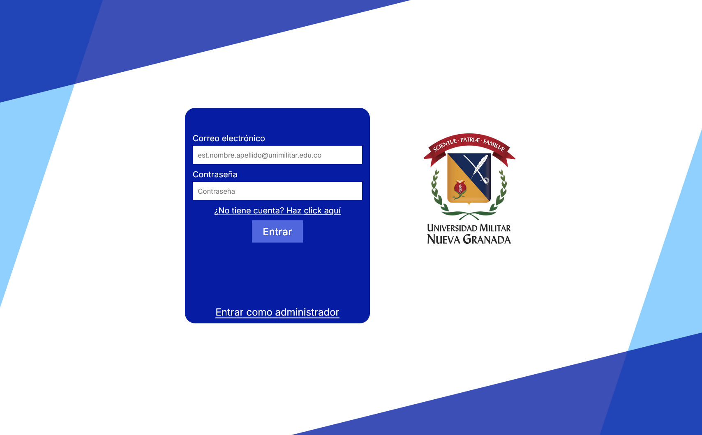

# Sistema de Gestión de Documentos y Laboratorios (UMNG)

[](README.en.md)


> **⚠️ ADVERTENCIA: Estado del Servidor**
> Actualmente, el servidor backend (PHP/MySQL) se encuentra **inhabilitado**. Por esta razón, las funciones de _inicio de sesión_, _registro_ y _envío de datos_ no están operativas en la demostración en vivo. El sitio puede visualizarse en modo "solo frontend" para apreciar la interfaz, la maquetación y la validación de formularios.

---

### 🌐 [Visitar Sitio Web Desplegado]([INSERTAR_TU_LINK_AQUI](https://pintomultimedia2002.github.io/Servicio-web/))

---

Aplicación web desarrollada como proyecto final para la asignatura de **Tecnologías de Internet (2023-1)**. Este sistema simula un servicio web para la autenticación de alumnos y profesores, facilitando la gestión de peticiones de acceso a laboratorios y la revisión de documentación administrativa en la **Universidad Militar Nueva Granada**.

## 📖 Descripción

El proyecto soluciona la necesidad de digitalizar el flujo de revisión de documentos académicos. Permite a los usuarios registrarse e iniciar sesión según su rol (Administrativo o Profesor) para realizar tareas específicas:

- **Profesores:** Envío de documentos, revisión de firmas y seguimiento de errores.
- **Administrativos:** Revisión de listas de documentos, aprobación de trámites y gestión de contratación.

## 🚀 Características Principales

### 🔐 Autenticación y Seguridad

- **Login y Registro:** Interfaz gráfica personalizada con formularios de acceso.
- **Validación Cliente:** Scripts en JavaScript (`login.js`) para validar campos vacíos y asegurar la integridad de los datos antes del envío.
- **Backend Básico:** Conexión a base de datos MySQL mediante PHP para el registro de usuarios.

### 👨‍🏫 Módulo Docente

- **Carga de Archivos:** Interfaz visual para la simulación de "Drag & Drop" de documentos.
- **Feedback de Estado:** Pantallas de confirmación de éxito (`Enviadoexito.html`) o reporte de errores (`listacontra.html`).

### 🏢 Módulo Administrativo

- **Dashboard de Revisión:** Vistas dedicadas para revisar documentos, firmas y contratación.
- **Flujo de Trabajo:** Botones funcionales para "Aprobar" o marcar "A corregir" en las listas de documentos.

## 🛠️ Tecnologías Utilizadas

- **Frontend:** HTML5, CSS3 (Diseño responsivo y posicionamiento personalizado), JavaScript (Vanilla).
- **Backend:** PHP (Manejo de formularios y conexión a BD).
- **Base de Datos:** MySQL.

## 📂 Estructura del Proyecto

```text
├── css/                 # Estilos para Login y Registro
├── imagenes/            # Recursos gráficos (Iconos, Logos)
├── img/                 # Imágenes de fondo y estructura
├── js/                  # Lógica de validación (login.js)
├── php/                 # Scripts de servidor (data.php)
├── old_site.../         # Vistas del Dashboard (Admin/Profesor)
├── index.html           # Página de Inicio de Sesión
└── registerLogin.html   # Página de Registro
```

## ⚙️ Instalación y Uso

Para ejecutar este proyecto en un entorno local:

1. **Requisitos:** Necesitarás un servidor local como **XAMPP** , **WAMP** o **MAMP** que soporte PHP y MySQL.
2. **Clonar el repositorio:**

   ```
   git clone https://github.com/pintomultimedia2002/Servicio-web.git
   ```
3. **Configuración de Base de Datos:**

   - El archivo `php/data.php` contiene la configuración de conexión. Asegúrate de importar la estructura de la tabla `user` en tu gestor de base de datos local.
   - _Nota: Para producción, se recomienda utilizar variables de entorno para las credenciales._
4. **Despliegue:**

   - Coloca la carpeta del proyecto en el directorio `htdocs` (XAMPP) o `www` (WAMP).
   - Accede desde tu navegador a `http://localhost/nombre-repo/index.html`.

## 📸 Capturas de Pantalla



## ✒️ Autores

**David Pinto** - Ingeniero Multimedia.

- [GitHub](https://github.com/pintomultimedia2002)
- [LinkedIn](https://www.linkedin.com/in/pinto-gomez-david/)

**Santiago Henao** - Ingeniero Multimedia.

- [GitHub](https://github.com/Sant-Hen)
- [LinkedIn](https://www.linkedin.com/in/santiago-henao-aguirre-a846682b1/)

---

_Este proyecto fue desarrollado con fines académicos para la Universidad Militar Nueva Granada._
